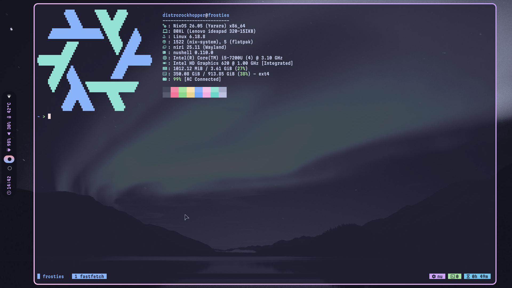

# melatonin-niri

**melatonin-niri** is a Niri rice I created, with Catppuccin Macchiato colors!

## Image


## Installation
There are *two methods* to install this rice

### Method 1 - Using [Dotkeeper](https://github.com/StikyPiston/dotkeeper)

Firstly, ensure you have **Dotkeeper** installed. Install **Dotkeeper** with:

```bash
brew install stikypiston/formulae/dotkeeper
```

Then, run the following to install the rice:

```bash
mkdir -p $HOME/.dotkeep
cd $HOME/.dotkeep
git clone https://github.com/stikypiston/melatonin-niri
```

To activate the rice, ensure all dependencies are installed, and run `dotkeeper activate melatonin-niri`

### Method 2 - Manual Install

Run `git clone https://github.com/StikyPiston/melatonin-niri`

Copy the contents of `config` to `~/.config/`

Install any needed dependencies (niri, waybar, vicinae, etc.)
